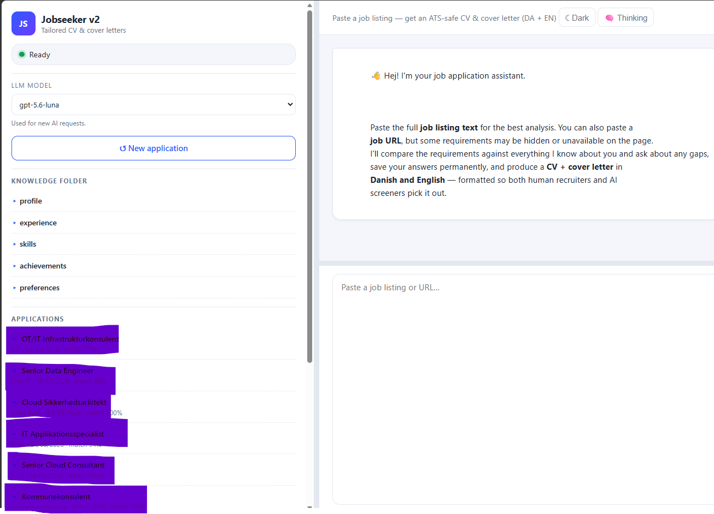

# Jobseeker v2

A local web chat assistant that turns a job listing into tailored CV and cover-letter PDFs in English and Danish.

## Screenshot



## Knowledge folder

The `knowledge/` folder contains the candidate's private source information. It is intentionally excluded from Git by `.gitignore` and must be created/populated separately on each machine.

This public repository includes fictional starter data in `sample/knowledge/` for
**John Doe**. It is safe demonstration content only; do not use it as a real
CV. After cloning, copy those files into a local `knowledge/` folder:

```powershell
New-Item -ItemType Directory -Force knowledge
Copy-Item sample\knowledge\* knowledge\
```

Then replace the fictional content with your own information. The live
`knowledge/` folder remains ignored by Git so private candidate data is not
accidentally published.

The app reads these Markdown files:

| File | What it should contain |
| --- | --- |
| `knowledge/profile.md` | Name, contact details, location, LinkedIn URL, headline, languages, and professional identity |
| `knowledge/experience.md` | Employment history, job titles, employers, dates, responsibilities, technologies, and project context |
| `knowledge/skills.md` | Technical skills, platforms, tools, methods, certifications, and confirmed skills from previous applications |
| `knowledge/achievements.md` | Measurable results, metrics, awards, major projects, and business impact |
| `knowledge/preferences.md` | Preferred roles, industries, locations, work arrangements, salary considerations, and application-writing preferences |

All five files are required for the best results. The app can start when one is missing, but it will have less information for matching jobs and generating documents. Use Markdown headings and bullet points; write truthful, specific details and include numbers wherever possible.

Example structure:

```text
# Profile
- Name: Your Name
- Location: Aarhus, Denmark
- LinkedIn: https://linkedin.com/in/your-profile

# Experience
## Company — Job title | 2020–Present
- Responsibility or achievement
- Result with a measurable outcome
```

The application may append confirmed skills to `knowledge/skills.md` after an interview. Back up this folder locally; it contains personal data and should not be committed to a public repository.

## Setup

Requirements: Node.js 22 or newer and GitHub Copilot CLI access.

```powershell
npm install
Copy-Item .env.example .env
# Create/populate the five files in knowledge\
npm run build
npm start
```

Open <http://localhost:4173>.

Useful environment variables are documented in `.env.example`, including `PORT`, `COPILOT_MODEL`, `COPILOT_CLI_PATH`, and `KNOWLEDGE_DIR`.

The sidebar model selector lists the Copilot models available to the logged-in
account. Changing it applies to the next analysis, interview, or document
generation request; `COPILOT_MODEL` remains the startup default.

Expanded knowledge files can be edited directly in the sidebar. Click **Save
changes** to write the Markdown file locally; the updated content is used by
the next job analysis or document generation request.

## Configuration

Role-specific fallback parsing rules are stored in `config/fallback-rules.md`.
When the model cannot parse a listing, the app reads the supported role titles
and fallback keyword vocabulary from that file. Add or remove terms there
without editing `src/analysis.ts`.

Candidate-specific identity and experience belong in `knowledge/`, not in the
TypeScript source. This keeps the application reusable for another candidate.

## Output

Generated files are written to `applications/`, which is also excluded from Git:

- English CV PDF
- Danish CV PDF
- English cover-letter PDF
- Danish application PDF
