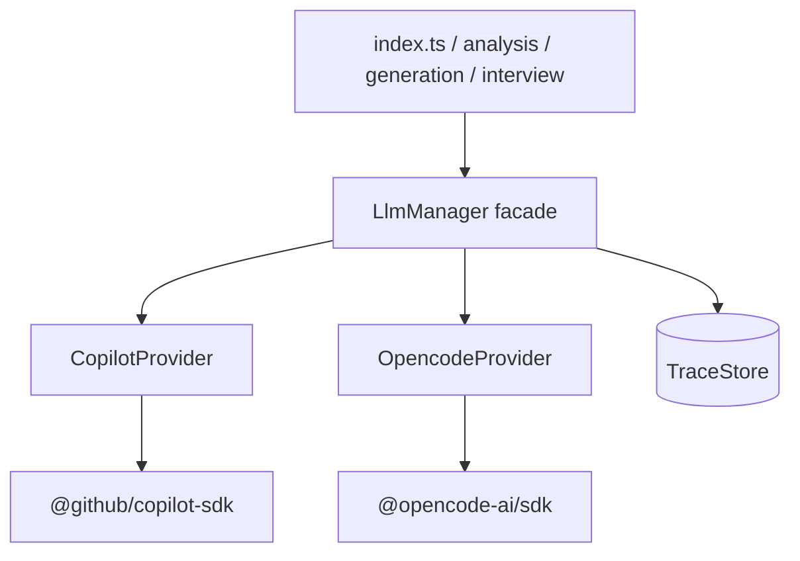

# ADR 0001 — Pluggable LLM providers (GitHub Copilot + opencode)

- **Status:** Implemented (phases 0–5)
- **Date:** 2026-09-09
- **Deciders:** japperJ
- **Related:** `src/llm/`, `src/config.ts`, `src/prompts.ts`, `src/public/app.js`

## Context

Jobseeker v3 generates all of its AI output through a single class, `CopilotManager`
(`src/copilot.ts`), which wraps the `@github/copilot-sdk`. That is a good start — every
LLM call in the app already funnels through one `run()` method — but the Copilot SDK is
woven into the app at seven points, and two of them *actively reject* any non-Copilot
model. There is no seam to add a second provider.

We want to add [opencode](https://dev.opencode.ai/docs/sdk/) as a second backend so the
app can run against models that Copilot does not expose (and so it does not depend on a
Copilot CLI login). This ADR records the target shape and the migration plan.

### Current coupling inventory

| # | Coupling | Location |
|---|----------|----------|
| 1 | Callers import the concrete `CopilotManager` class as a type — no interface | `analysis.ts:1`, `generation.ts:1`, `interview.ts:1`, `index.ts:5` |
| 2 | `RunOptions.systemMessage` is Copilot's `SystemMessageConfig`; all 4 call sites cast `as never` | `copilot.ts:11`, `analysis.ts:112`, `generation.ts:29`, `interview.ts:23,48` |
| 3 | `normalizeCopilotModel()` **discards** any `provider/model` that is not `github-copilot/` and falls back to `github-copilot/gpt-5.6-luna` | `config.ts:24-33` |
| 4 | `setModel()` throws unless the ID starts with `github-copilot/` | `copilot.ts:194-200` |
| 5 | `listModels()` filters the SDK list down to `github-copilot/*` (and explicitly drops `opencode/*`) | `copilot.ts:173-188` |
| 6 | Streaming is Copilot's `session.on("assistant.message")` event, not token deltas | `copilot.ts:139-146` |
| 7 | No credential path at all — auth is the Copilot CLI's own login | `.env.example` |
| 8 | UI assumes a flat list of `github-copilot/…` IDs; no provider concept | `app.js:781-800`, `/api/models`, `/api/model` |
| 9 | `copilot.ts` has no tests and no mock seam | — |

### What is already portable

- All prompt **text** lives in `src/prompts.ts` and is provider-agnostic.
- `TraceEvent` is already provider-neutral (it only carries label/model/timing/text).
- Timeouts, run labels, and the single retry-on-failure are already centralised in `run()`.
- Only 6 `manager.run()` call sites exist (2 in `analysis.ts`, 2 in `interview.ts`, 1 in
  `generation.ts`, 1 in `index.ts`).

## Decision

Introduce a **`LlmProvider` interface** with one implementation per backend, behind a
**`LlmManager` facade** that keeps today's public surface (`run`, `listModels`,
`getModel`, `setModel`, `health`, `stop`) so `index.ts` and the HTTP API barely change.

The provider-neutral contract is **plain-text in, plain-text out**:

- `systemPrompt?: string` replaces `systemMessage?: SystemMessageConfig`. Each provider
  adapts it to whatever its backend wants. This removes the four `as never` casts.
- `onChunk?: (delta: string) => void` is defined as a **text delta**. Copilot's
  `assistant.message` event carries whole-message content, so `CopilotProvider` emits the
  content it has not yet emitted; opencode emits real deltas from its event stream.



### Interface

```ts
// src/llm/types.ts
export interface LlmRunOptions {
  prompt: string;
  systemPrompt?: string;          // plain text — replaces SystemMessageConfig
  timeoutMs?: number;
  onChunk?: (delta: string) => void;
  model?: string;                 // canonical ID, e.g. "opencode/anthropic/claude-sonnet-4"
  label?: string;
  onTrace?: (event: TraceEvent) => void;
  jsonSchema?: { name: string; schema: unknown };  // optional, see Phase 5
}

export interface LlmProvider {
  readonly id: "github-copilot" | "opencode";
  run(opts: LlmRunOptions): Promise<string>;
  listModels(): Promise<string[]>;
  getModel(): string;
  setModel(model: string): void;
  health(): Promise<boolean>;
  stop(): Promise<void>;
}
```

`TraceEvent` moves out of `copilot.ts` into `src/llm/types.ts` (it was never
Copilot-specific). `src/trace.ts` updates its one import.

### Canonical model IDs

`<provider>/<model>`, split on the **first** slash only:

| Canonical ID | Backend |
|---|---|
| `github-copilot/gpt-5.6-luna` | Copilot SDK, bare model `gpt-5.6-luna` |
| `opencode/anthropic/claude-sonnet-4-20250514` | opencode SDK, `providerID: "anthropic"`, `modelID: "claude-sonnet-4-20250514"` |

The `<model>` half may itself contain a slash for opencode, because opencode identifies
models as `providerID/modelID`. Routing is by first segment, so the two namespaces cannot
collide.

> **Collision note:** the Copilot SDK also surfaces its own third-party-routed models
> under an `opencode/*` prefix, which `listModels()` filters out today. That filter stays
> as-is — it only ever applies to the Copilot SDK's list. Our provider prefix is applied
> by `LlmManager`, not by the SDK.

### opencode SDK mapping

Verified against <https://dev.opencode.ai/docs/sdk/>:

| Capability | opencode SDK call |
|---|---|
| Install | `npm i @opencode-ai/sdk` |
| Start server + client | `createOpencode({ hostname, port, signal, timeout, config })` → `{ client, server }` |
| Attach to running server | `createOpencodeClient({ baseUrl: "http://localhost:4096" })` |
| Health | `client.global.health()` → `{ healthy, version }` |
| List models | `client.config.providers()` → `{ providers: Provider[], default: {...} }`, flattened to `opencode/<providerID>/<modelID>` |
| List agents | `client.app.agents()` |
| Create session | `client.session.create({ body: { title } })` |
| Send prompt | `client.session.prompt({ path: { id }, body: { model: { providerID, modelID }, parts: [{ type: "text", text }] } })` |
| Streaming | `client.event.subscribe()` → `for await (const e of events.stream)`, `e.type` / `e.properties` |
| Cancel | `client.session.abort({ path: { id } })` |
| Credentials | `client.auth.set({ body: { type: "api", key } })`, or opencode's own env/auth store |
| Structured output | `body.outputFormat: { type: "json_schema", schema, retryCount }` → `result.data.info.structured_output` |

**System prompt:** opencode's `session.prompt` has no system-message parameter. Two
options, to be settled in Phase 2:

1. **Agent-based (preferred).** Ship an `opencode.json` agent (e.g. `jobseeker`) whose
   system prompt is `SYSTEM_IDENTITY` + `SYSTEM_TONE`, with tools disabled, and pass
   `agent` on session create. Keeps the prompt payload clean and matches how opencode
   expects to be configured.
2. **Prepend.** Concatenate `systemPrompt` into the user text. Zero config, but pollutes
   the trace view and the prompt shown in the UI.

**Tools:** Copilot is given `tools: []` explicitly. opencode agents have tools by default,
so the agent must declare an empty tool set — otherwise a model may try to read or write
files, which this app must never let happen (all file I/O is server-side).

### Configuration

```dotenv
# Provider used at startup: github-copilot (default) | opencode
LLM_PROVIDER=github-copilot
LLM_MODEL=github-copilot/gpt-5.6-luna

# Copilot backend
COPILOT_CLI_PATH=

# opencode backend
# If set, attach to an already-running server; otherwise spawn one via createOpencode()
OPENCODE_BASE_URL=http://localhost:4096
OPENCODE_AGENT=jobseeker
```

`COPILOT_MODEL` stays as a deprecated alias for `LLM_MODEL` for one release.
`normalizeCopilotModel()` is replaced by `normalizeModelId()`, which validates the
provider prefix against the registry instead of hard-coding `github-copilot`.

### HTTP API and UI

- `GET /api/health` → `{ ok, copilot: bool, providers: { "github-copilot": bool, opencode: bool } }`
  (keep `copilot` for back-compat).
- `GET /api/models` → `{ models, current, providers: [{ id, models }] }`.
- `POST /api/model` → accepts any registered canonical ID; the "not available" check
  queries the owning provider.
- `app.js`: render the model `<select>` with one `<optgroup>` per provider.

## Implementation plan

| Phase | Work | Risk |
|---|---|---|
| 0 | Move `TraceEvent` to `src/llm/types.ts`; update `trace.ts`. No behaviour change. | none |
| 1 | Add `LlmProvider` + `LlmManager`; port `CopilotManager` → `CopilotProvider`; swap `systemMessage` for `systemPrompt: string`; update the 6 call sites and delete `src/copilot.ts`. | low — pure refactor, verify with `npm run typecheck` + `npm test` |
| 2 | Add `OpencodeProvider` (spawn-or-attach, session per run, SSE streaming, `abort` on timeout). Decide agent-vs-prepend for the system prompt. | **medium** — see risks |
| 3 | Config (`LLM_PROVIDER`, `LLM_MODEL`, `OPENCODE_*`), registry, API + UI changes, `.env.example`, README. | low |
| 4 | Tests: a `FakeProvider` implementing `LlmProvider`, plus a contract test run against both providers. First test coverage for the LLM layer. | low |
| 5 | *(optional)* Expose `jsonSchema` on `LlmRunOptions` so opencode can use native structured output, replacing the regex `extractJson` in `analysis.ts` / `interview.ts`. | medium — changes output parsing |

Phases 0–1 ship independently and are invisible to users. Phase 2 is the only one that
adds a runtime dependency.

## Risks and mitigations

| Risk | Mitigation |
|---|---|
| opencode server lifecycle — `createOpencode()` needs the opencode binary installed and spawns a process on port 4096 | Prefer `OPENCODE_BASE_URL` attach mode; document the binary requirement; treat spawn failure as "provider unavailable" rather than a crash |
| opencode agent may use tools | Ship an agent with an empty tool set; assert in tests that no tool parts appear in the response |
| Exact SSE event type names for text deltas are not pinned in the docs | Verify against the installed SDK's generated types during Phase 2; `OpencodeProvider` filters defensively and falls back to the final message text |
| Copilot emits whole messages, not deltas — `onChunk` semantics differ | `CopilotProvider` tracks emitted length and sends only the new suffix |
| System-prompt handling differs (structured sections vs. plain text) | `systemPrompt: string` is the contract; `CopilotProvider` rebuilds the `{ mode: "customize", sections: { identity, tone } }` object from it |
| Model-ID collision with the Copilot SDK's own `opencode/*` entries | Routing is by first segment inside `LlmManager`; the Copilot SDK's internal filter is untouched |
| Two providers means two failure modes in `/api/health` | Report per-provider health; the app only needs the active one |

## Alternatives considered

1. **Keep `CopilotManager` and add a second manager class.** Cheapest, but duplicates
   retry/timeout/trace logic and leaves call sites provider-aware. Rejected.
2. **Go straight to the Vercel AI SDK / LangChain.** More providers for free, but a large
   dependency and it would not use the opencode SDK, which is the explicit ask. Rejected
   for now; the `LlmProvider` interface keeps this door open.
3. **Talk to provider HTTP APIs directly (OpenAI/Anthropic).** Avoids both SDKs, but loses
   Copilot support and re-implements auth per provider. Rejected.

## Resolved questions

1. **Spawn or attach?** Attach when `OPENCODE_BASE_URL` is set, otherwise spawn via
   `createOpencode()`. Verified: spawning works out of the box and discovered 350 models.
2. **Agent-based or prepend for the system prompt?** Prepend — the prompt is passed as
   the `system` field on `session.prompt`, with `OPENCODE_AGENT` selecting the agent
   (default: the server's own default). This keeps one code path for every agent and
   needs no agent file on disk.
3. **One active provider or both?** One active model at a time, switchable at runtime
   through `POST /api/model`; both providers stay registered and health-checked so the
   UI can list and switch between them without a restart.

## Verification

- `npm run typecheck` and `npm run build` pass; `npm test` passes (49 tests, 19 of them
  new coverage for `src/llm/`).
- Live smoke test: `GET /api/health` reported both providers healthy, `GET /api/models`
  returned 28 Copilot and 350 opencode models grouped by provider, `POST /api/model`
  accepted an opencode ID, and `POST /api/message` produced a reply through the opencode
  backend.
3. Do we surface both providers in the UI at once, or keep one active provider with a
   switch? (Recommendation: one active provider, switchable at runtime.)
